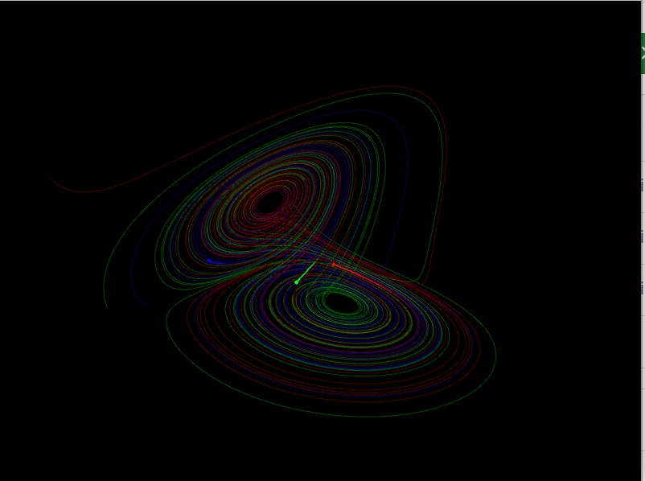

A processing code to visualize dynamical systems. Lorenz, Aizawa, Halvorsen systems are implemented but other ones could be easily added. The integration method is forward Euler.  

#### How to run the code:  
Install processing and run the code dynamical_systems.pde. Note that the extension PeasyCam must be installed.

#### Commands:  
* Left click to rotate the view.  
* Use two fingers in the trackpad to zoom out and in.

#### Gallery of pictures obtained with the code

  

Obtained with version 1 preset 1

  

Obtained with version 1 preset 2

  

Obtained with version 1 preset 3

  

Obtained with version 1 preset 4

  

Obtained with version 2 preset 1

  

Obtained with version 2 preset 1

  

Obtained with version 2 preset 2

  

Obtained with version 2 preset 3

  

Obtained with version 3 preset 1

  

Obtained with version 3 preset 2

